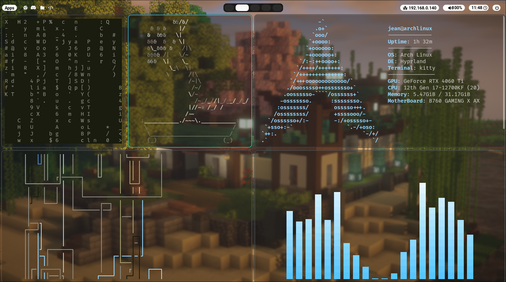
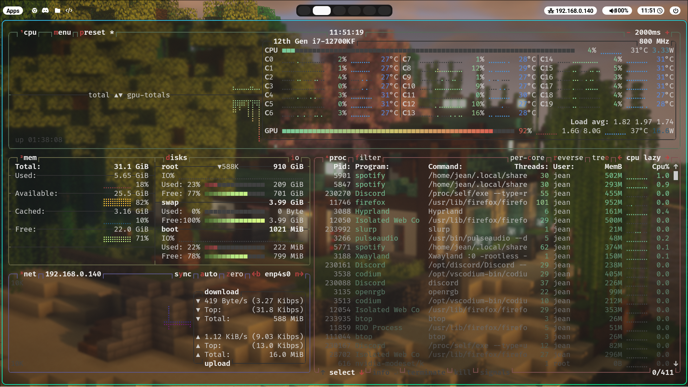
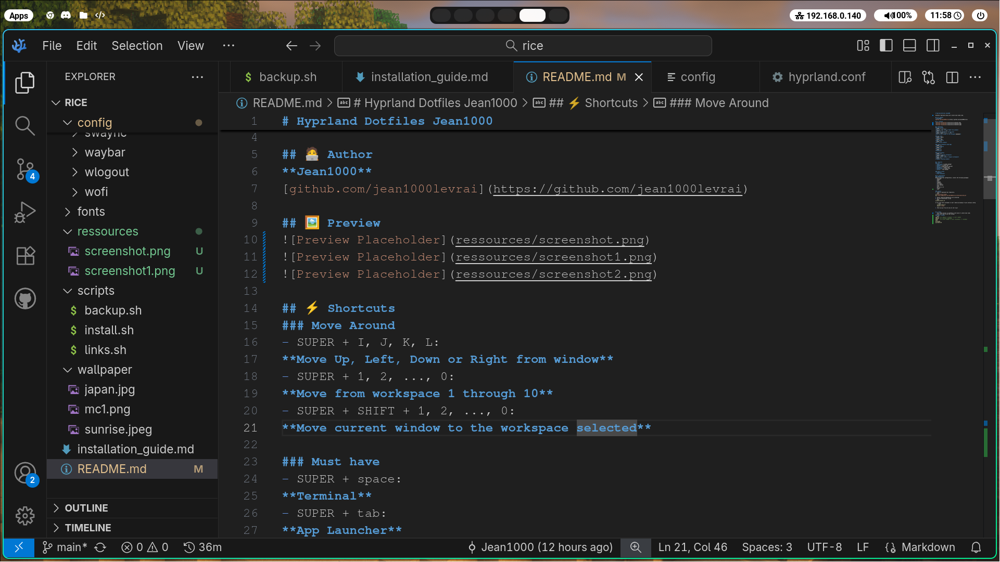

# Hyprland Dotfiles Jean1000

Aesthetic Hyprland setup with a white neon kinda vibe.

## 🧑‍💻 Author
**Jean1000**  
[github.com/jean1000levrai](https://github.com/jean1000levrai)

## 🖼️ Preview





## ⚡ Shortcuts
### Move Around
- SUPER + I, J, K, L: 
**Move Up, Left, Down or Right from window**
- SUPER + 1, 2, ..., 0: 
**Move from workspace 1 through 10**
- SUPER + SHIFT + 1, 2, ..., 0: 
**Move current window to the workspace selected**

### Must have
- SUPER + space:
**Terminal**
- SUPER + tab:
**App Launcher**
- SUPER + Q:
**Kill active window**

### Launch Frequently Used Apps
- SUPER + E:
**File manager**
- SUPER + F:
**Firefox**
- SUPER + C:
**VSCodium**

### Miscellaneous
- SUPER + S:
**Creates a magical workspace**
- SUPER + SHIFT + S:
**Moves current window to magical workspace**
- SUPER + V:
**Toggles floating window**


## ✨ Features
### Core
- **Hyprland** – window manager
- **Waybar** – status bar
- **Wofi** – application launcher
- **Wlogout** – logout menu
- **Neofetch** – system info
- **Btop** - task manager

### Fonts & Icons
- **Roboto**
- **Font Awesome**

## ⚙️ Installation
### Dependencies
Before using this configuration, install the following packages:
 - hyprland
 - waybar
 - wofi
 - wlogout
 - neofetch
 - ttf-roboto
 - font awesome
 - btop
 - gtk 3.0 & 4.0
 - swaync
 - cava

### Install
1. Clone or download this repository.
```bash
cd path/to/your/folder
git clone git@github.com:Jean1000levrai/config-hyprland.git
```   
2. Ensure required dependencies are installed.   
3. Use the installation script
```bash
scripts/install.sh
```
If you feel extra confident or don't need any backups of your previous config
   ```bash
   scripts/links.sh
   ```
`install.sh` creates backups by copying each riced folder already existing with `<name>_backup`.   
`links.sh` does not create any backups of your riced folders, use it if you used links with your previous config OR if it is a fresh install.   

4. Reload hyprland
```bash
hyprctl reload
```   

5. There you go! You are now all set to go!


## 📝 Notes
 - This setup focuses on aesthetics with kind of a white neon vibe;
 - Users are free to use this config.
### Config
- GPU: RTX 4060 ti
- CPU: i7 12700kf
- RAM: 32 Gb DDR5

### Small trinkets
```bash
cmatrix  # -b (Bold) -C <colour> -u <int> (speed)
cbonsai  # -l to see it growing
pipes    # -p <int> (speed) -t <int> (thickness) -r (rainbow)
cava
hollywood
asciiquarium
```
